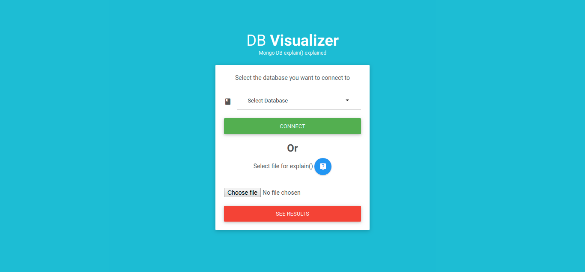
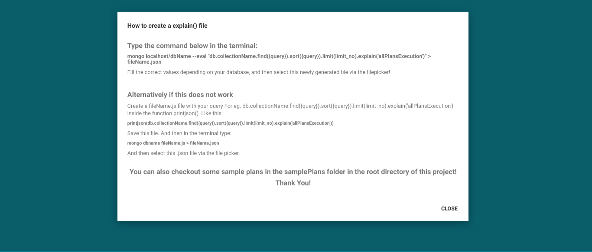
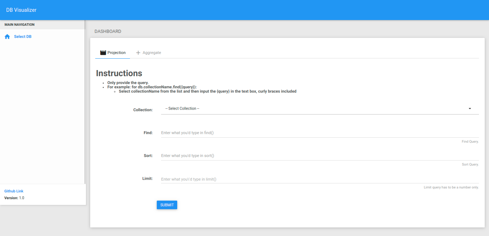
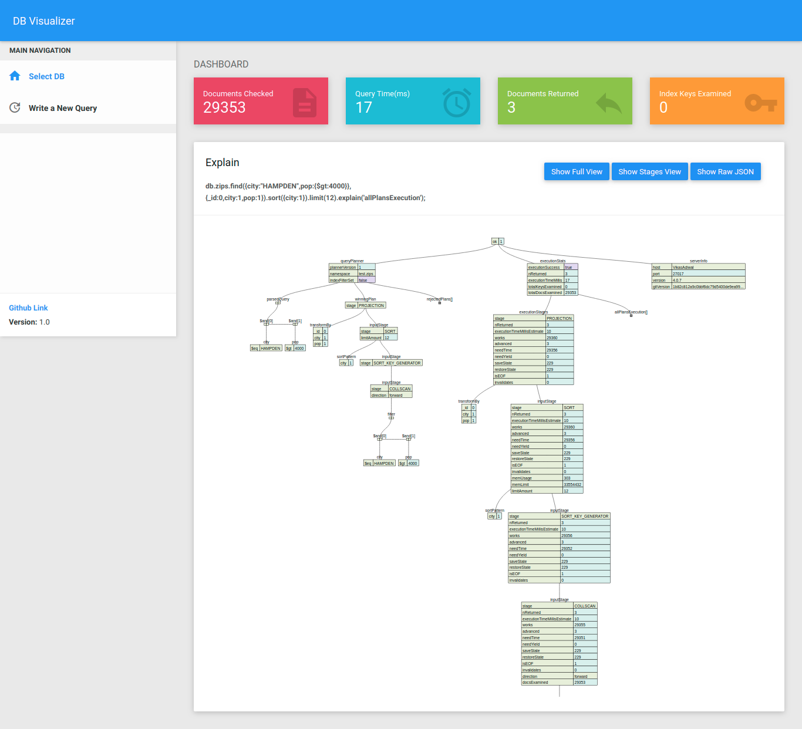

## Installation
> ### Prerequisites:
> 1. Download the installer.sh from the releases page of this repository. [a link] (https://github.com/adiwalv/DB-Explain-Visualizer/releases)

> 2. Run the script 

```bash
sudo sh installer.sh
```

### Sample DB

I have included a sample DB for testing.
You can import it using :

```bash
mongoimport -v --file=sample_db/zips.json
```
This will create a Database named 'test' and using that db it will fill up collection 'zips'. Now you can fire up these commands below to parse Query Plan. For example:
```bash
mongo localhost/test --eval "db.zips.find().limit(10).explain('allPlansExecution')" > test.json
```


# Screenshots

## Homepage



## Create a .json file for your database query. Press ? on the homepage



## Explain a custom query



## Result of Explain


